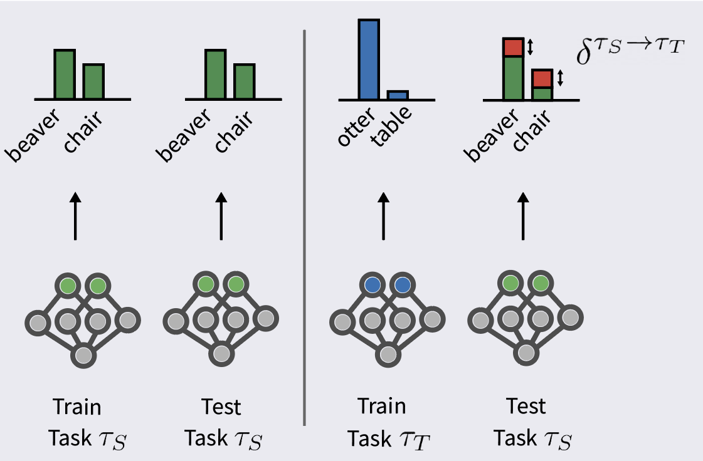

# PCA-OGD
Official code for [A Theoretical Analysis of Catastrophic Forgetting through the NTK
Overlap Matrix](https://arxiv.org/abs/2010.04003) (AISTATS 2021)


<center>

</center>


## Prerequisites
- `requirements.txt`

## Instructions

- Clone the repo
- Run scripts:  `scripts/commands` 
- Hyperparameters in Table 4 of the Appendix of the [paper](https://arxiv.org/pdf/2010.04003.pdf) 
               
## Also includes:
- Implementation of [Orthgohonal Gradient Descent (OGD)](https://arxiv.org/pdf/2010.04003.pdf) (Farajtabar et al., 2019)


## To cite:

```
@article{doan2020theoretical,
  title={A Theoretical Analysis of Catastrophic Forgetting through the NTK Overlap Matrix},
  author={Doan, Thang and Bennani, Mehdi and Mazoure, Bogdan and Rabusseau, Guillaume and Alquier, Pierre},
  journal={arXiv preprint arXiv:2010.04003},
  year={2020}
}
```
